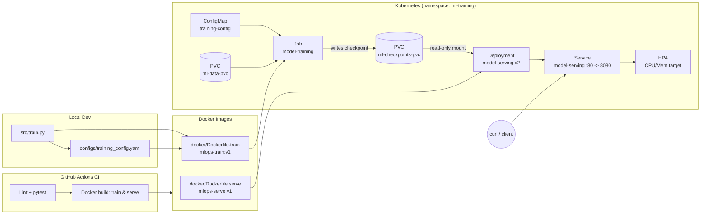

# mlops-pytorch-pipeline

An end-to-end MLOps pipeline that trains a CIFAR-10 image classifier in PyTorch,
containerizes training and serving with Docker, and deploys both to Kubernetes
using Jobs, a Deployment, ConfigMaps, and an HPA.

## Architecture



**Flow:** code is developed and tested locally → CI lints and builds both
images on every PR → the training image runs as a Kubernetes `Job`, reading
its config from a `ConfigMap` and writing a checkpoint to a `PersistentVolumeClaim`
→ once training completes, the serving `Deployment` mounts that same PVC
read-only, runs 2+ replicas behind a `Service`, and autoscales via `HPA`.

## Repository structure

```
mlops-pytorch-pipeline/
├── README.md
├── .gitignore
├── .github/workflows/ci.yml
├── src/
│   ├── train.py
│   ├── model.py
│   ├── dataset.py
│   └── serve.py
├── configs/
│   └── training_config.yaml
├── docker/
│   ├── Dockerfile.train
│   └── Dockerfile.serve
├── k8s/
│   ├── namespace.yaml
│   ├── pvc.yaml
│   ├── configmap.yaml
│   ├── secret.example.yaml
│   ├── training-job.yaml
│   ├── serving-deployment.yaml
│   ├── serving-service.yaml
│   └── hpa.yaml
├── requirements/
│   ├── train.txt
│   └── serve.txt
└── tests/
    └── test_model.py
```

## Prerequisites

- Python 3.10+
- Docker Desktop (or a Docker-enabled VM)
- `kubectl`
- A Kubernetes cluster (Minikube, kind, or a cloud-managed cluster)
- A GitHub account

## Local development

```bash
python -m venv .venv && source .venv/bin/activate
pip install -r requirements/train.txt
pip install pytest ruff

# Run unit tests
pytest tests/ -v

# Train locally (writes to ./data and ./checkpoints)
python src/train.py --config configs/training_config.yaml
```

## Docker

```bash
# Build training image
docker build -f docker/Dockerfile.train -t mlops-train:v1 .

# Run training with mounted volumes
mkdir -p data checkpoints
docker run --rm \
  -v $(pwd)/data:/app/data \
  -v $(pwd)/checkpoints:/app/checkpoints \
  mlops-train:v1

# Build serving image
docker build -f docker/Dockerfile.serve -t mlops-serve:v1 .

# Run serving
docker run --rm -p 8080:8080 \
  -v $(pwd)/checkpoints:/app/checkpoints:ro \
  mlops-serve:v1

# Health check
curl http://localhost:8080/health

# Test prediction endpoint
curl -X POST http://localhost:8080/predict \
  -F "image=@test_image.png"
```

> The serving image installs **only** inference dependencies (FastAPI,
> uvicorn, torch/torchvision, Pillow) — no `tensorboard` or other
> training-only libraries — and runs as a non-root `appuser` (uid 1000).

## Kubernetes

```bash
# Namespace, config, and storage
kubectl apply -f k8s/namespace.yaml
kubectl apply -f k8s/pvc.yaml
kubectl apply -f k8s/configmap.yaml

# (optional) secrets — copy the example, fill in real values, apply,
# but never commit the filled-in file (see .gitignore)
cp k8s/secret.example.yaml k8s/secret.yaml
kubectl apply -f k8s/secret.yaml

# Load local images into your cluster if using Minikube/kind, e.g.:
minikube image load mlops-train:v1
minikube image load mlops-serve:v1

# Run training as a Job
kubectl apply -f k8s/training-job.yaml
kubectl wait --for=condition=complete job/model-training -n ml-training --timeout=1800s
kubectl logs -n ml-training job/model-training

# Deploy serving once training has produced a checkpoint
kubectl apply -f k8s/serving-deployment.yaml
kubectl apply -f k8s/serving-service.yaml
kubectl apply -f k8s/hpa.yaml   # requires metrics-server installed in-cluster

# Verify
kubectl get pods -n ml-training
kubectl describe deployment model-serving -n ml-training

# Test the prediction endpoint
kubectl port-forward svc/model-serving 8080:80 -n ml-training
curl -X POST http://localhost:8080/predict -F "image=@test_image.png"
```

**GPU training:** `k8s/training-job.yaml` includes a commented-out GPU
variant (`nvidia.com/gpu: 1` request + node selector/toleration) — uncomment
and adjust the node selector for your cluster's GPU node pool.

**HPA note:** the `HorizontalPodAutoscaler` requires the `metrics-server`
add-on. On Minikube: `minikube addons enable metrics-server`.

## Git workflow

- `main` — protected, production-ready
- `develop` — integration branch, created from `main`
- `feature/*` — all work happens here (e.g. `feature/docker-training`,
  `feature/k8s-deployment`), merged into `develop` via PR with a description
- Commits follow [Conventional Commits](https://www.conventionalcommits.org/)
  (`feat:`, `fix:`, `chore:`, `docs:`, …)
- Secrets are never committed — see `k8s/secret.example.yaml` and
  `.gitignore` (`k8s/*secret*.yaml` is excluded except `*.example.yaml`)

Suggested PR sequence:

| PR | Branch | Scope |
|----|--------|-------|
| 1 | `feature/pytorch-model` | `src/model.py`, `src/dataset.py`, `tests/test_model.py` |
| 2 | `feature/docker-training` | `docker/Dockerfile.train`, `requirements/train.txt`, `src/train.py` |
| 3 | `feature/docker-serving` | `docker/Dockerfile.serve`, `requirements/serve.txt`, `src/serve.py` |
| 4 | `feature/k8s-deployment` | everything under `k8s/`, README updates |

## Testing

```bash
pytest tests/ -v
ruff check src/ tests/
```

CI (`.github/workflows/ci.yml`) runs lint + tests, then builds both Docker
images on every push/PR to `main` and `develop`.
